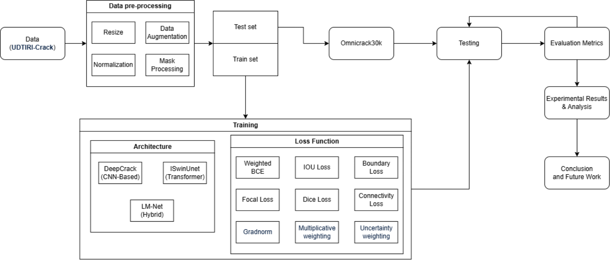
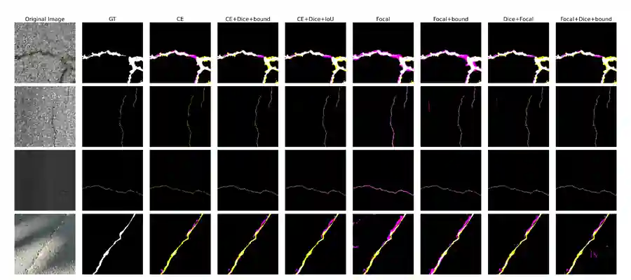
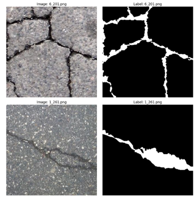
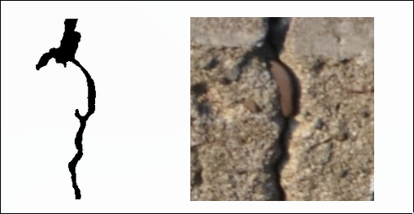

# DeepCrack Research — U-DeepCrack Architecture & Loss Optimization

> **Status: active research / in development**  
> This public repository is intentionally **documentation- and results-focused**. Training code, model implementations, experiment notebooks, checkpoints, and raw logs are withheld while the research is being consolidated for possible journal publication.

## Overview

This project studies **road crack segmentation from two complementary directions: architecture design and loss-function optimization**.

The first direction is **U-DeepCrack**, a project-specific architectural extension developed from **DeepCrack** ([Liu et al., 2019](https://doi.org/10.1016/j.neucom.2019.01.036)). The goal is to improve spatial reconstruction of thin crack structures while preserving the hierarchical supervision that is central to the original DeepCrack formulation.

The second direction is a systematic study of **segmentation objectives and loss balancing**. Crack pixels are sparse, thin, and structurally sensitive, so the optimization objective strongly affects recall, false positives, continuity, and overlap metrics. The project therefore evaluates single losses, multi-loss combinations, fixed weighting, and adaptive weighting methods such as **GradNorm** and **uncertainty-based weighting**.

These two directions are intentionally studied together: U-DeepCrack provides an architectural extension of the DeepCrack baseline, while the loss-function study investigates how that architecture should be optimized and whether the same conclusions transfer to other segmentation architectures.

## Main Research Contributions

### 1. U-DeepCrack architecture

U-DeepCrack extends the DeepCrack architecture proposed by [Liu et al. (2019)](https://doi.org/10.1016/j.neucom.2019.01.036) with a U-Net-style reconstruction path. The implemented version combines:

- a VGG16-based hierarchical encoder;
- a four-stage decoder with progressive upsampling;
- encoder-decoder skip connections;
- double-convolution reconstruction blocks;
- five side outputs;
- deep supervision and fused prediction.

Compared with the original DeepCrack design ([Liu et al., 2019](https://doi.org/10.1016/j.neucom.2019.01.036)), which primarily upsamples hierarchical side predictions to the input resolution, U-DeepCrack reconstructs spatial information progressively through a decoder while retaining multi-scale supervision.

An attention-gated extension of U-DeepCrack has also been prototyped and remains under evaluation.

### 2. Loss-function and optimization study

The project systematically investigates how the training objective changes segmentation behavior. The study includes:

- BCE / cross-entropy;
- Dice loss;
- IoU loss;
- Focal loss;
- Boundary-oriented loss;
- Connectivity-oriented loss;
- multi-loss combinations;
- fixed manual weighting;
- **GradNorm** adaptive weighting;
- a multiplicative GradNorm variant;
- **uncertainty-based loss weighting**.

The goal is not only to identify a high-scoring configuration, but to understand how different objectives trade precision, recall, overlap quality, crack continuity, and optimization stability.

### 3. Cross-architecture and cross-dataset validation

The loss strategies are also being evaluated beyond U-DeepCrack, including DeepCrack-derived and lightweight segmentation models such as LM-Net, to determine whether observed behavior is architecture-specific or more general.

Generalization is evaluated by training/validating on UDTIRI-Crack and testing on a different crack dataset, OmniCrack30K.

## Research Questions

The project is organized around several questions:

- Can U-Net-style reconstruction improve the spatial-detail limitations of the original DeepCrack architecture ([Liu et al., 2019](https://doi.org/10.1016/j.neucom.2019.01.036))?
- How should hierarchical side supervision be combined with decoder-based reconstruction for thin crack structures?
- Which objective functions best handle severe crack/background imbalance?
- How do BCE, Dice, IoU, Focal, Boundary, and Connectivity-oriented losses change the precision-recall trade-off?
- Do combinations of complementary objectives generalize better than single losses?
- Can adaptive weighting prevent one objective from dominating multi-loss optimization?
- How do **GradNorm** and **uncertainty weighting** behave compared with fixed loss weights?
- Do architectural and loss-function improvements remain useful under cross-dataset evaluation?

## Research Workflow

The project jointly studies **architecture design** and **loss-function optimization**, then evaluates how the resulting choices transfer across architectures and datasets.

<p align="center">
  
</p>

<p align="center"><i>Research workflow covering U-DeepCrack architecture development, loss-function optimization, cross-architecture validation, and cross-dataset evaluation.</i></p>

The baseline in this workflow refers to **DeepCrack: A Deep Hierarchical Feature Learning Architecture for Crack Segmentation** ([Liu et al., 2019](https://doi.org/10.1016/j.neucom.2019.01.036)).

## U-DeepCrack Experimental Platform

U-DeepCrack is the main architecture represented in the public consolidated results. Its combination of hierarchical side outputs, decoder reconstruction, and deep supervision makes it useful for studying both **architectural reconstruction quality** and **multi-objective optimization behavior**.

One archived run reported approximately **25.86M parameters**. The architecture itself is part of the project's research contribution rather than merely a neutral benchmark for the loss study.

## Loss-Function Study

### Static objective ablations

The static study evaluates both individual and combined segmentation losses. The consolidated U-DeepCrack results currently contain **23 static-loss configurations**.

| U-DeepCrack loss configuration | UDTIRI Val Dice | UDTIRI Val IoU | OmniCrack30K Test Dice | OmniCrack30K Test IoU | Patch Test Dice | Patch Test IoU |
|---|---:|---:|---:|---:|---:|---:|
| CE + Dice + IoU + Focal | 0.7100 | 0.5504 | **0.4039** | **0.2991** | 0.4088 | 0.3058 |
| IoU | 0.7005 | 0.5390 | 0.3989 | 0.2965 | **0.4111** | **0.3078** |
| Dice + CE | 0.7086 | 0.5487 | 0.3991 | 0.2975 | 0.4049 | 0.3046 |

These runs show why the project evaluates both validation and external-test behavior: a configuration that is strong on UDTIRI validation is not automatically the strongest after transfer to OmniCrack30K.

### Qualitative comparison across loss functions

The following qualitative examples compare U-DeepCrack predictions under several loss configurations. The overlay highlights different error types rather than showing only a binary prediction mask:

- **Magenta = False Positive (FP):** predicted crack pixels that are not present in the ground truth.
- **Yellow = False Negative (FN):** ground-truth crack pixels missed by the model.
- **White = correctly segmented crack pixels / agreement with the ground truth.**
- **Black = background.**



The examples illustrate why metric-only comparison is insufficient for this task. Different objectives can produce similar overlap scores while exhibiting visibly different failure modes, such as thicker false-positive regions, disconnected crack segments, or missed thin branches.

### Adaptive loss weighting — U-DeepCrack

The adaptive study replaces manually fixed weights with dynamic weighting strategies. The finalized U-DeepCrack summary currently contains four adaptive experiments:

| Adaptive method | Objective set | UDTIRI Val Dice | Val IoU | OmniCrack30K Test Dice | Test IoU | Best epoch |
|---|---|---:|---:|---:|---:|---:|
| GradNorm | CE + Dice | 0.6358 | 0.4661 | 0.3418 | 0.2528 | 87 |
| GradNorm + ML | CE + Dice | 0.6009 | 0.4161 | 0.3134 | 0.2541 | 47 |
| Uncertainty weighting | CE + Dice | **0.6584** | **0.4908** | **0.4126** | **0.3035** | 88 |
| Uncertainty weighting | CE + Dice + Focal | 0.6376 | 0.4847 | 0.3914 | 0.2879 | 79 |

For U-DeepCrack, **uncertainty weighting with CE + Dice** gives the strongest adaptive result in both UDTIRI validation and OmniCrack30K cross-dataset testing. Adding Focal loss does not improve the adaptive result in this architecture, while the multiplicative GradNorm variant also does not produce a consistent gain over standard GradNorm.

### Adaptive weighting across architectures

The same weighting strategies were evaluated on LM-Net and iSwinUnet. The strongest cross-dataset adaptive configuration differs by architecture:

| Model | Strongest adaptive configuration on OmniCrack30K | UDTIRI Val Dice | Test Dice | Test IoU |
|---|---|---:|---:|---:|
| LM-Net | Uncertainty (CE + Dice) | 0.7881 | 0.3720 | 0.2723 |
| iSwinUnet | Uncertainty (CE + Dice + Focal) | 0.6969 | 0.3945 | 0.2888 |
| U-DeepCrack | Uncertainty (CE + Dice) | 0.6584 | **0.4126** | **0.3035** |

This comparison is useful for the research question itself: **the preferred weighting strategy is architecture-dependent**, so a loss-weighting method should not be judged only on one network.

## Evaluation Protocol

The project uses two crack-segmentation datasets with different roles:

- **UDTIRI-Crack** is used for model training and validation. The dataset setup available to this project does not provide a public test split used in the experiments, so UDTIRI results are reported only for train/validation.
- **OmniCrack30K** is used as an external test dataset to evaluate how a model trained on UDTIRI transfers beyond the training/validation distribution.

The OmniCrack30K numbers should therefore be interpreted as **cross-dataset test performance**, not as a same-dataset held-out UDTIRI test score.

### Dataset Examples

The project deliberately separates the **training/validation domain** from the **external evaluation domain**. The examples below provide a visual reference for the two datasets used in this protocol.

<table>
  <tr>
    <td align="center" width="50%">
      
    </td>
    <td align="center" width="50%">
      
    </td>
  </tr>
  <tr>
    <td align="center"><b>UDTIRI-Crack</b><br><sub>Training / validation domain</sub></td>
    <td align="center"><b>OmniCrack30K</b><br><sub>External cross-dataset test domain</sub></td>
  </tr>
</table>

These examples are included to make the domain shift in the evaluation setup easier to understand; the reported OmniCrack30K metrics remain the quantitative measure of cross-dataset generalization.

## Consolidated Results

The public U-DeepCrack result table is available at:

[`results/udeepcrack_results.csv`](results/udeepcrack_results.csv)

It contains **27 U-DeepCrack experiments**:

- **23** static loss-function ablations;
- **4** adaptive loss-weighting experiments.

Metrics are normalized to a **0–1 scale** and the table keeps source-traceability and data-quality notes. Historical source irregularities are flagged instead of silently corrected.

The qualitative comparison figure is stored at:

[`results/udeepcrack_qualitative_loss_comparison.webp`](results/udeepcrack_qualitative_loss_comparison.webp)

## Current Research Status

| Workstream | Status |
|---|---|
| DeepCrack 2019 reproduction and analysis ([Liu et al., 2019](https://doi.org/10.1016/j.neucom.2019.01.036)) | Completed internally |
| U-DeepCrack architectural extension | Implemented and evaluated internally |
| Single-loss ablations | Completed across multiple objectives |
| Static multi-loss combinations | Completed across multiple configurations |
| GradNorm adaptive weighting | Evaluated internally |
| Multiplicative GradNorm variant | Evaluated internally |
| Uncertainty-based adaptive weighting | Evaluated internally |
| Attention U-DeepCrack extension | Prototype / under evaluation |
| Cross-architecture validation | In progress |
| Final consolidated benchmark | In progress |
| Journal-ready method and manuscript | Not finalized |

## Evaluation Focus

Experiments track more than a single segmentation score. The analysis includes:

- Dice / F1;
- crack IoU and mean IoU;
- precision and recall;
- false-positive / false-negative behavior;
- crack continuity and boundary quality;
- optimization stability;
- computational cost;
- transfer from UDTIRI-Crack to OmniCrack30K.

The broader aim is to understand **how architecture design and objective design interact when segmenting thin, highly imbalanced crack structures**.

## Public Repository Scope

The following materials are intentionally **not distributed** in this repository:

- model and loss implementation code;
- training and evaluation scripts;
- Jupyter notebooks;
- experiment automation utilities;
- checkpoints and trained weights;
- raw training logs;
- unpublished implementation details.

Selected consolidated result tables and qualitative visualizations are published when they communicate the research progress without exposing implementation details that may become part of a journal submission.

## Technologies Used Internally

The internal research workflow uses **Python, PyTorch, GPU-based training, semantic segmentation, deep supervision, encoder-decoder architectures, multi-objective optimization, and systematic experiment tracking**.

## Research Context

The project builds directly on DeepCrack ([Liu et al., 2019](https://doi.org/10.1016/j.neucom.2019.01.036)) and established ideas from U-Net-style reconstruction, deep supervision, multi-objective optimization, GradNorm, and uncertainty-based weighting. **U-DeepCrack is the project's architectural extension of the DeepCrack baseline**, while the loss study forms the second major research axis. Project-specific implementation details remain private while the work is under development.

## References

- Liu, Y., Yao, J., Lu, X., Xie, R., & Li, L. (2019). **DeepCrack: A Deep Hierarchical Feature Learning Architecture for Crack Segmentation.** *Neurocomputing, 338*, 139–153. Elsevier. https://doi.org/10.1016/j.neucom.2019.01.036

<details>
<summary>BibTeX</summary>

```bibtex
@article{liu2019deepcrack,
  title={DeepCrack: A Deep Hierarchical Feature Learning Architecture for Crack Segmentation},
  author={Liu, Yahui and Yao, Jian and Lu, Xiaohu and Xie, Renping and Li, Li},
  journal={Neurocomputing},
  volume={338},
  pages={139--153},
  year={2019},
  publisher={Elsevier},
  doi={10.1016/j.neucom.2019.01.036}
}
```

</details>

## Repository Status

This repository will be updated as the research matures and as additional results become appropriate for public release.